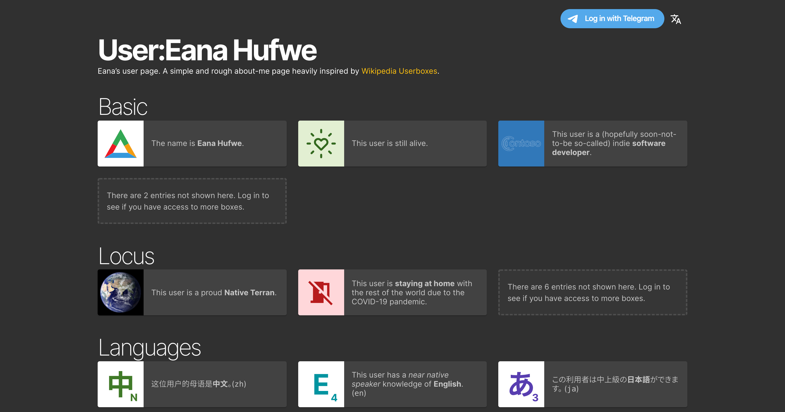
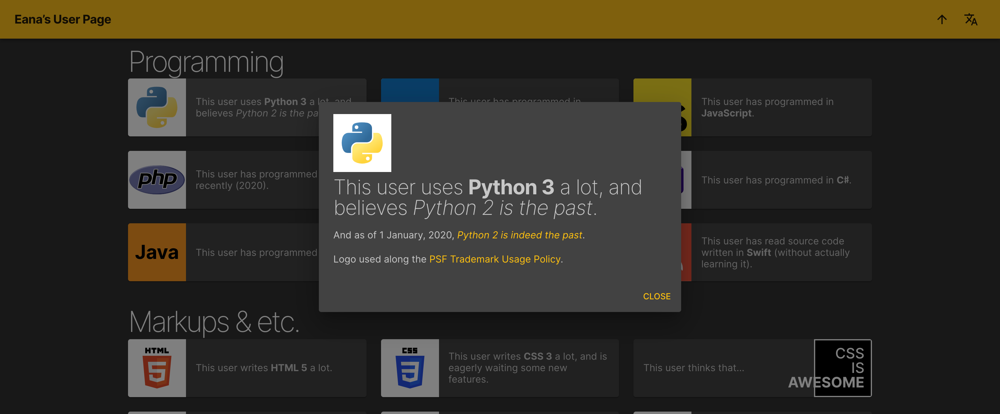

User:Eana Hufwe
===============

Eana’s user page. A simple and rough about-me page heavily inspired by [Wikipedia Userboxes](https://en.wikipedia.org/wiki/Wikipedia:Userboxes). 

[See demo here](https://labs.1a23.com/userpage/).

Built with Node.js, Express, React, Material-UI and Next.js.




## Features

* Multilingual support
* Telegram authentication for access control
* Level-based granular visibility for each entry
* Markdown support

## Build and run in development environment

### 1. Add necessary data to run (see below)

### 2. Backend
```shell
cd backend
npm install
PORT=3000 npm run dev
```

### 3. Frontend
```shell
cd frontend
yarn install
PORT=3001 yarn start
```

## Where to change?
- Title, subtitle, footer, open-graph information, etc are all hardcoded.
- List of supported languages in `frontend/src/components/LangSwitcher.tsx`
- Translated strings in `frontend/src/i18n.ts`
- Telegram Bot ID in `frontend/src/components/TelegramAuth.tsx`
- Database file in `backend/src/static/data.yaml`

### Structure of `data.yaml`

```yaml
token: "1234:abcdEFGH1234-5678"  # Your Telegram Bot Token

trusted:
    777000: 100   # Telegram user ID: trust level
    777001: 50    # Higher the trust level, more entries are shown

entries:
  - name:   # name of section
      en: Section  # Translated names
      zh: 章节
      ja: 章
      "08n": Hapxì
    items:
      - level: 0  
        # Trust level of entry, required.
        # Higher the value, less people can see.
        # 0 means open to anonymous users
        desc:  # Short description shown on the outside, required.
          en: This is written **on the card**
          # Markdown enabled.
        details:  # Shown when clicked in, optional.
          # Markdown enabled.
          en: |
            Long detail text.

            [Example link](https://example.com/).
        leftImage: image.svg
        rightImage: image.svg
        # Image shown on the side, optional. Path relative to /images (frontend/public/images).
        leftComponent: <TextBox>Text</TextBox>
        rightComponent: <TextBox>Text</TextBox>
        # Component to show instead of image, optional.
        # Markdown enabled.
        # Only one of [image or component or nothing] can be set on each side.
```

### Existing custom components in all contexts
#### `<a>`
Styled link.
#### `<kbd>`
Styled keyboard key.
#### `<abbr>`
Abbreviation tag with tooltip support.
#### `<AgeValue>`
Show number of years past from a timestamp.

Usage:
```
It has been <AgeValue since={1587300000000} /> year(s) since then.
```
#### Add more...
See `frontend/src/utils.ts`.

### Existing custom components in box compoenents
#### `<AgeBox>`
Show number of years past from a timestamp.

Usage:
```
<AgeBox since={1587300000000} />
```
#### `<TextBox>`
Centered, styled text. Preserves line breaks.

- fontSize: optional (e.g. "2rem")
- backgroundColor: optional (e.g. "#ffffff")
- color: optional (e.g. "#000000")
- fontWeight: optional (e.g. "100")

Usage:
```
<TextBox>line 1
line 2</TextBox>
```

#### `<DateBox>`
Show the current date formatted.

- format: date format, required. (e.g. "Y M D", see [Moment.js](https://momentjs.com/docs/#/displaying/) for syntax)
- fontSize: optional (e.g. "2rem")
- backgroundColor: optional (e.g. "#ffffff")
- color: optional (e.g. "#000000")
- fontWeight: optional (e.g. "100")
- monospace: use tabular figures, boolean, default: false.

Usage:
```
<DateBox format="Y M D" monospace />
```


#### `<AwesomeBox>`
Show an “CSS IS AWESOME” box, right aligned.

Usage:
```
<AwesomeBox/>
```

#### Add more...
See `frontend/src/components/EntryMedia.tsx`.


## License
This project is licensed under MIT License.